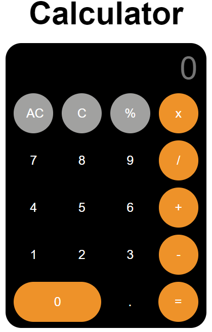

# Awesome Calculator



Welcome to the Awesome Calculator GitHub repository! This repository contains the source code for an awesome and user-friendly calculator built using HTML, CSS, and JavaScript. With a sleek design and accurate calculations, this calculator is perfect for all your mathematical needs.

## Table of Contents
- [Introduction](#introduction)
- [Demo](#demo)
- [Features](#features)
- [Installation](#installation)
- [Usage](#usage)
- [Customization](#customization)
- [Contributing](#contributing)
- [Contact](#contact)

## Introduction
The Awesome Calculator is a web-based calculator that provides essential arithmetic functions along with percentage calculation. It ensures smooth and precise calculations while maintaining an intuitive user interface for a delightful user experience.

## Demo
Try out the live demo of the Awesome Calculator [here](https://sofiaradionov.github.io/simple-calculator/).

## Features
- Addition, subtraction, multiplication, and division operations.
- Support for floating-point numbers with the decimal point represented by a dot (`.`).
- Percentage calculation for easy value adjustments.
- Clear all and clear character buttons for convenient input correction.

## Installation
To get the Awesome Calculator up and running on your local machine, follow these steps:

1. Clone this repository to your local machine:

```bash
git clone https://github.com/your-username/awesome-calculator.git
```

2. Navigate to the project directory:

```bash
cd awesome-calculator
```

## Usage
Open the `index.html` file in your web browser, and you're ready to perform all your calculations using the Awesome Calculator. Simply input your numbers and operators, and press the equal (=) button to see the result. It's that easy!

## Customization
The Awesome Calculator's design and functionality are easily customizable. You can modify the colors, font styles, or add more features to suit your preferences or integrate it into your projects seamlessly.

## Contributing
Contributions to enhance the Awesome Calculator are most welcome! Whether you have bug fixes, new features, or usability improvements, feel free to open a pull request. Together, we can make this calculator even more awesome!

## Contact
If you have any questions, suggestions, or just want to say hi, you can reach out to us through the following channels:
- Email: sofiaradionov7@gmail.com
- WhatsApp: +37360518333

Thank you for checking out our Awesome Calculator! We hope you find it useful and enjoy using it for all your mathematical adventures.

Happy calculating! 🧮
